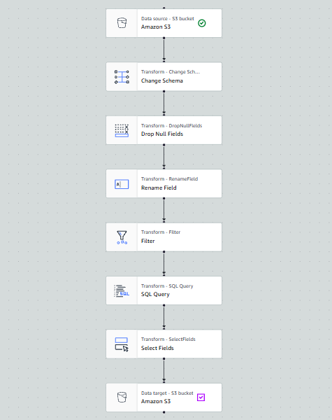
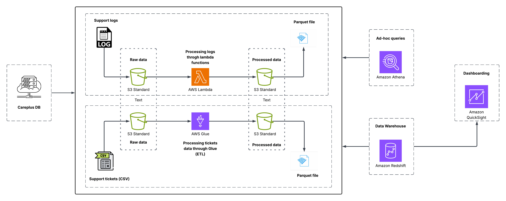
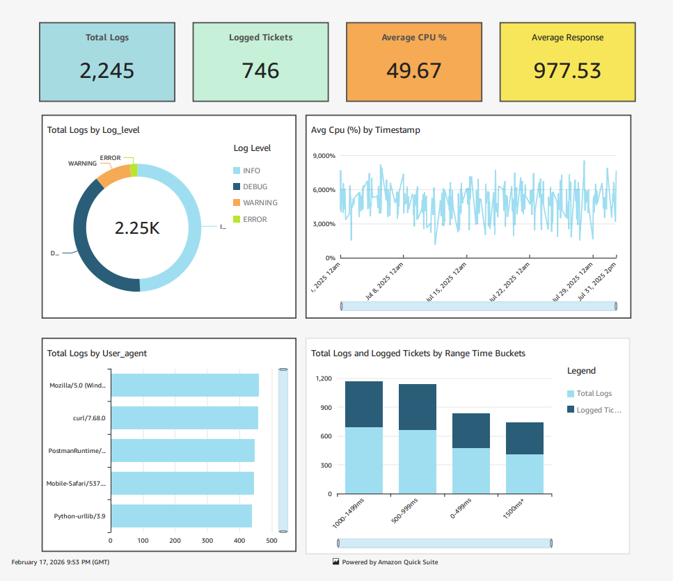
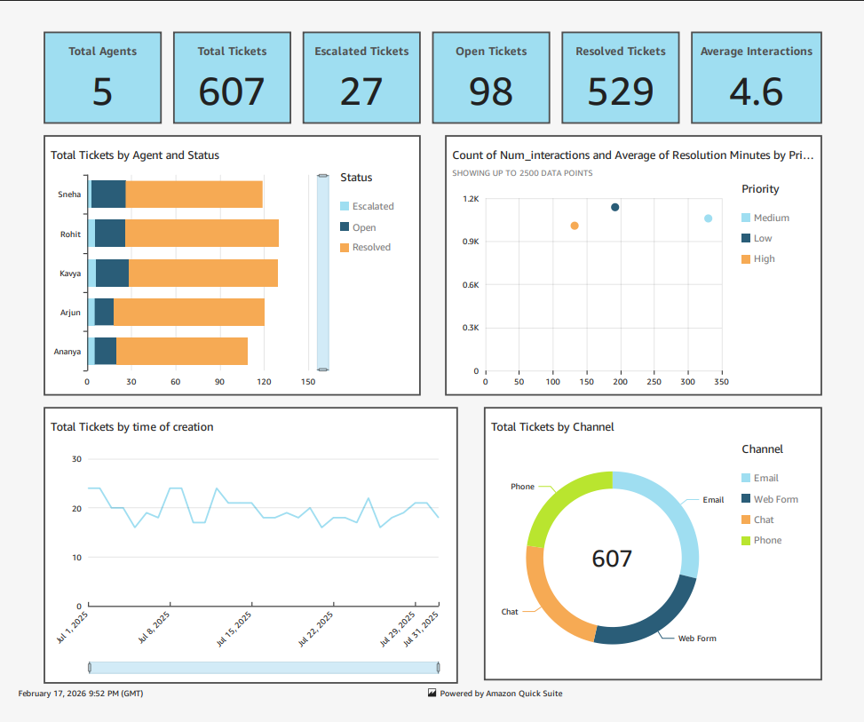

# careplus-data-pipeline-aws

This project moves support logs and support tickets through ingestion, transformation, and analytics on AWS.

## Project Summary

### Data ingestion
- Loads raw data into S3.
- `support-logs/support_logs_ingestion_to_S3.py` uploads logs to `support-logs/raw-data/`.
- `support-tickets/support_tickets_ingestion_to_S3.py` pulls tickets from MySQL and uploads to `support-tickets/raw-data/`.
- Shared AWS config lives in `data-ingestion/.env`.

### Data transformation
- Converts raw data into processed data.
- `support-logs-lambda/automate_support_log_etl.py` is a Lambda transform for logs (outputs Parquet to `support-logs/processed-data/`).
- `support-tickets-glue-etl/automate_support_tickets_etl.py` is a Lambda trigger that starts the Glue visual ETL job for tickets.
## Visual ETL on AWS Glue

### Architecture

### Support-logs Quicksight

### Support-tickets Quicksight

### Data Warehouse
- Analytics and warehouse assets.
- `athena-sql-queries/` contains ad-hoc SQL queries on S3.
- `redshift-setup/` contains Redshift setup/load files.
- `dashboard/` contains reporting assets.

## End-to-End

1. Ingest data into S3 `raw-data` folders.
2. Transform into S3 `processed-data` folders (Lambda for logs, Glue for tickets).
3. Query and report using Athena, Redshift, and Quicksight.
